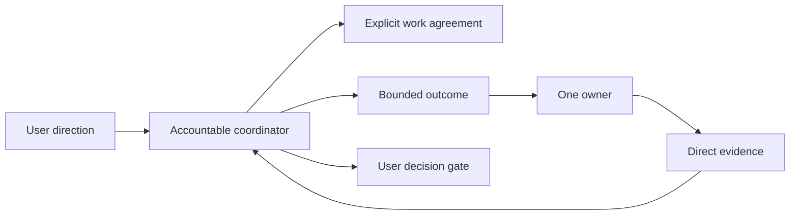

# What Survived Testing

[HEAD Agent Core](../../README.md) / [Learn](../README.md) / [Evolution](README.md) / What Survived Testing

## Core Claim

Simplification retained controls that continue to connect an action to observable evidence and clear ownership. It removed defaults that primarily multiplied machinery.

## Code-External Evidence

**Operational observation.** Some consequential questions cannot be resolved from an implementation surface alone. The surviving rule is not "always gather more data." It is to retrieve authoritative evidence outside the immediate code surface when that evidence can change the conclusion, then distinguish it from an unverified hypothesis.

## Behavior Rules

**Historical record.** Shared Core revisions reduced accumulated prohibitions and detailed procedure while retaining principles about deliberate context, explicit work models, progressive elaboration, coherent ownership, canon, decision ownership, and direct confidence-building evidence.

**Related theory.** This resembles an invariant-based design: preserve a small set of behavioral constraints that can guide new situations instead of enumerating every historical exception. The analogy is retrospective.

## Explicit Context Pointers

**Historical record.** Current architecture keeps broad project knowledge outside active context and uses references to retrieve the relevant canonical source. It also distinguishes durable work authority from mutable handoff records.

**Operational observation.** A pointer is useful when it lets an owner recover authoritative detail without treating every available document as active instruction.

## Bounded Ownership

**Historical record.** Both early and current material preserve the idea that work should have an accountable owner and that dependent results require integration. The surviving version narrows this to coherent outcomes rather than a permanent specialist hierarchy.

**Operational observation.** One owner can diagnose, act, and produce direct evidence for a bounded outcome with fewer handoff assumptions than a chain of narrowly split tasks.

## Direct Verification

**Generalized failure.** A review can pass against a reduced restatement of the task while the original outcome remains incomplete. Confidence in a report is not evidence that the requested result exists.

**Current response, supported by historical record.** Verification is retained as a separate step that checks observable results and relevant primary evidence before the result becomes the basis for later work.

## User Decision Gates

**Historical record.** Current principles retain material decision ownership for the user while assigning ordinary planning and execution decisions to the coordinator.

**Related theory.** This maps to decision-rights design: authority should sit with the party accountable for the consequences. It is an explanatory lens, not a historical claim about the original design method.

## Takeaway

The controls worth keeping are those that preserve authority, make work inspectable, and expose whether the intended result actually occurred.

Previous: [Hypotheses We Rejected](hypotheses-we-rejected.md) | Next: [Simplification After Complexity](simplification-after-complexity.md) | Chapter exit: [Adoption](../11-adoption/README.md)

Source classes: historical record; operational observation; generalized failure; related theory.
