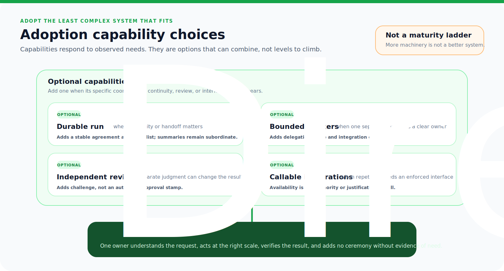

# Adoption: Use Only What The Work Needs

[HEAD Agent Core](../../README.md) / [Learn](../README.md) / Adoption

## Learning Objective

Decide whether the HEAD model fits a piece of work, adopt its smallest useful form, and retain human control over material direction.

## Core Claim

HEAD is a way to preserve ownership, evidence, and continuity as work becomes harder to hold in one conversation. It is not a required ceremony, an autonomous organization, or a guarantee of correct judgment.

## Chapter Map

1. [When You Need HEAD](when-you-need-head.md)
2. [Minimal Adoption](minimal-adoption.md)
3. [Separating Shared And Project](separating-shared-and-project.md)
4. [Maturity Levels](maturity-levels.md)
5. [Common Antipatterns](common-antipatterns.md)
6. [Security And Publication Boundaries](security-and-publication-boundaries.md)
7. [Limitations](limitations.md)

## Reading Position

Previous: [Evolution: What Evidence Changed](../10-evolution/README.md) | Next: [When You Need HEAD](when-you-need-head.md)

At the chapter exit, return to [Learn](../README.md) or the [HEAD Agent Core root](../../README.md). For current implementation contracts, use the [Shared Core](../../head/README.md), [Shared Skills](../../skills/README.md), [Shared MCP](../../mcp/README.md), [Shared Agents](../../agents/README.md), and [Project Layer](../../projects/README.md) references.

Source classes: current shared principles; current public reference contracts; operational observation.
