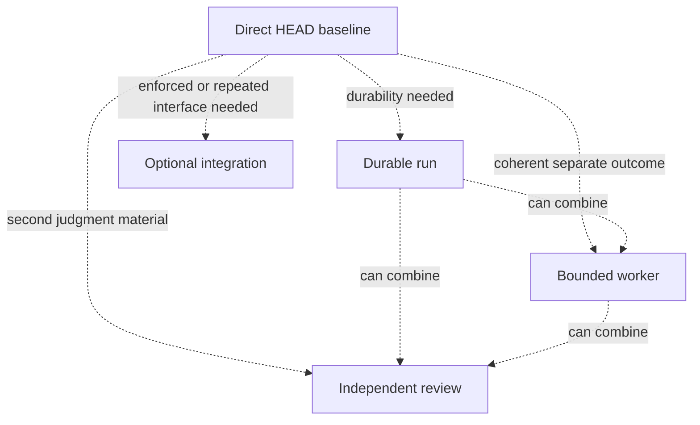

# Maturity Levels

[HEAD Agent Core](../../README.md) / [Learn](../README.md) / [Adoption](README.md) / Maturity Levels

## Learning Objective

Increase capability only where observed work creates a real need, rather than treating a larger architecture as a graduation requirement.

## Core Claim

Maturity is the ability to preserve correct ownership and evidence at the complexity actually present. Levels are optional additions, not a mandated sequence.

| Level | Add when | Capability | Cost and caution |
| --- | --- | --- | --- |
| 1. Direct HEAD | The result is small and immediately checkable | One owner understands, acts, and verifies | Avoid inventing a run or worker merely for formality. |
| 2. Durable run | Work may pause, span several outcomes, or need handoff | A stable user-HEAD agreement and checklist survive interruption | Keep the agreement authoritative; do not let summaries redefine it. |
| 3. Bounded workers | A separate owner can produce a coherent, observable result | Targeted delegation with bounded context and HEAD integration | Dispatching has setup and review cost; avoid disconnected task lists. |
| 4. Independent review | Separate judgment can materially change a consequential result | An evidence-based challenge before conclusion or action | Review is not an automatic approval stamp and does not transfer decision ownership. |
| 5. Optional integrations | A repeated operation needs a callable interface or enforced safety boundary | On-demand tools with defined authorization and operational contracts | Availability is not justification; tools need policy, evidence, and careful use. |

## Relationship Model

## Design Response

The current shared model keeps planning procedures, coordination interfaces, and reusable roles distinct. That separation permits a project to adopt direct HEAD work without inheriting every optional mechanism.

## Common Misunderstanding

"Level 5 is better than level 1." The appropriate level is the least complex one that makes the work understandable, recoverable, and verifiable.

## Takeaway

Add one capability in response to one demonstrated coordination, continuity, review, or interface need.

Previous: [Separating Shared And Project](separating-shared-and-project.md) | Next: [Common Antipatterns](common-antipatterns.md)

Source classes: current shared principles; current public reference contracts; operational observation.
