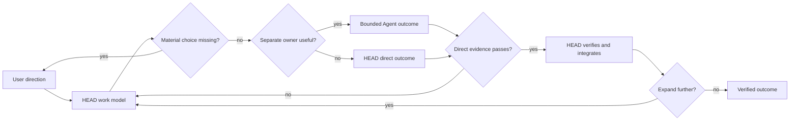
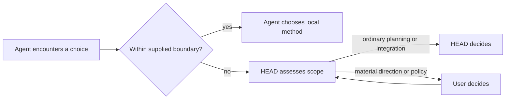
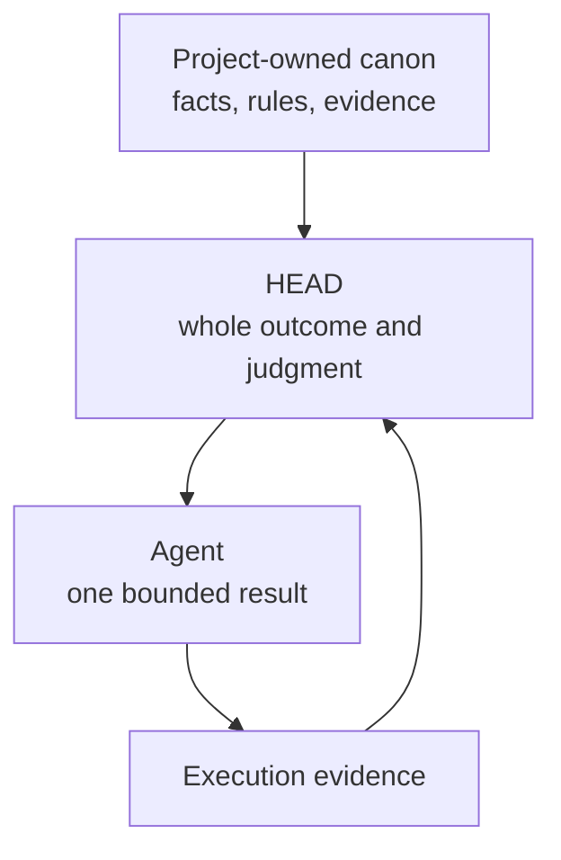
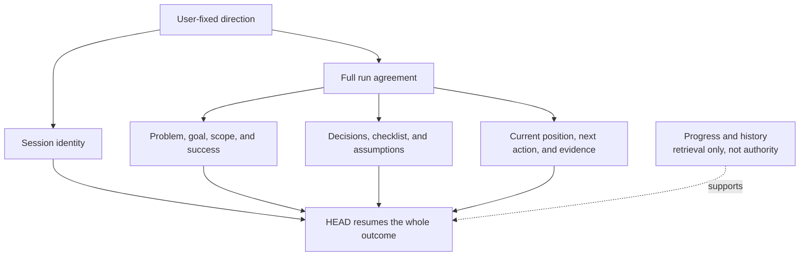
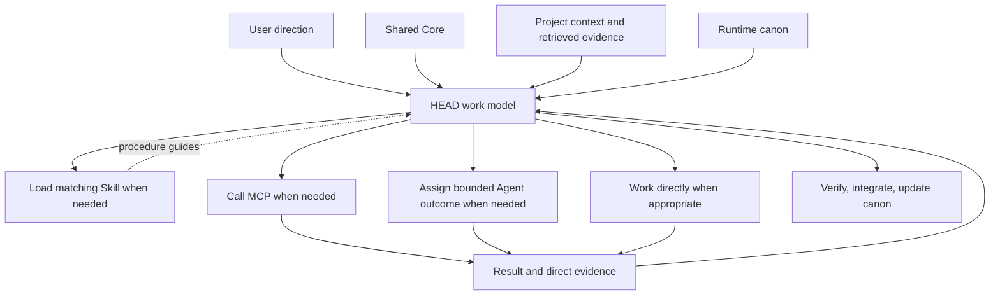

# Canonical Teaching Diagrams

[HEAD Agent Core](../README.md) / [Teach](README.md) / Canonical Teaching Diagrams

Use these diagrams as the single canonical versions for teaching routes. Link to an anchored diagram instead of copying its Mermaid source into a route or slide notes. The learning pages provide their chapter-specific explanatory diagrams.

## Controlled Expansion Loop

Use this to introduce the thesis: expand one coherent step, verify what changed, then make the result eligible to become input to later work. It is a relationship model, not a claim that every task needs an Agent or a formal gate.

Learning sources: [The One-Step Expansion Rule](../learn/02-llm-problem/the-one-step-expansion-rule.md), [Verification Before Expansion](../learn/02-llm-problem/verification-before-expansion.md).

## Decision-Rights Escalation

Use this when participants confuse a capable Agent with an authorized decision-maker. The Agent makes local execution choices within the supplied boundary without seeking approval and escalates choices that cross it. HEAD owns ordinary planning and integration; the User owns material direction.

Learning source: [Decision Rights](../learn/03-ownership/decision-rights.md).

## Context By Ownership

Use this to explain that context quality follows authority, relevance, timing, and ownership rather than maximum volume. Project canon remains with its change owner; HEAD composes what the whole outcome needs; an Agent receives the smallest complete context for its result.

Learning sources: [Context By Ownership](../learn/04-context/context-by-ownership.md), [Why More Context Is Not More Intelligence](../learn/02-llm-problem/why-more-context-is-not-more-intelligence.md).

## Durable Work Agreement

Use this to distinguish the two canonical recovery records from subordinate retrieval records. Session identity preserves the stable topic and constraints; the full run preserves the user-HEAD work agreement and recovery state. Progress and history can support retrieval but cannot replace either record or override the agreement.

Learning sources: [Context And Run](../learn/06-canon/context-and-run.md), [Fixing The Problem And Goal](../learn/06-canon/fixing-the-problem-and-goal.md), [Fragile Progress And History](../learn/06-canon/fragile-progress-and-history.md).

## Component Composition

Use this after the ownership and canon models. Component availability does not grant decision authority, and not every request needs every component.

Learning source: [How The Parts Compose](../learn/07-components/how-the-parts-compose.md).
